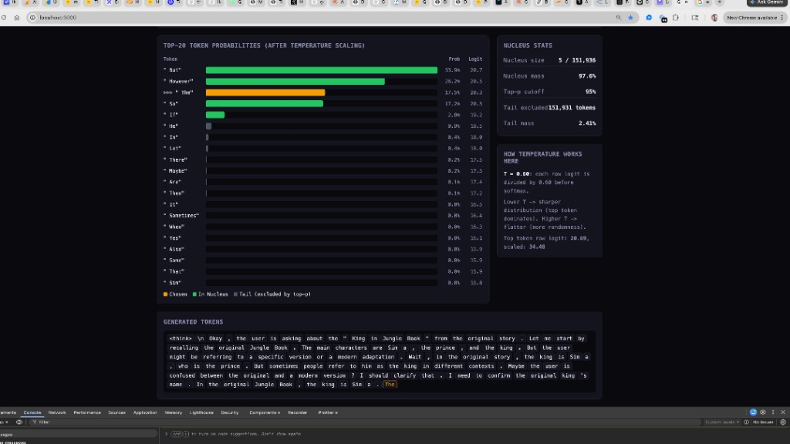

# Qwen3 Run Locally

Run **Qwen 3 0.6B** on your Mac with minimal setup: pure C inference, no Python, no CUDA, no cloud. This repo bundles the inference code and a step-by-step guide so you can run the model and understand how it works.

---

## Overview

| | |
|---|---|
| **Model** | Qwen 3 0.6B (FP32 GGUF) |
| **Inference** | [qwen3.c](https://github.com/thefirehacker/qwen3.c) — single-file C, no dependencies |
| **Platform** | macOS (Apple Silicon or Intel); CPU-only (OpenMP optional) |
| **Use case** | Learning inference, chat templates, tokenization, attention — see [First Break AI Step 2](https://thefirehacker.github.io/firstbreakai/roadmap.html) |

The model runs entirely on your machine. No API keys, no external services.

---

## Prerequisites

- **macOS** with Xcode Command Line Tools (for `clang` and `make`)
- **~3 GB disk space** for the FP32 model file
- **Git** (with [Git LFS](https://git-lfs.com/) for downloading the model)

Install Xcode CLI tools if needed:

```bash
xcode-select --install
```

---

## Quick Start

### 1. Clone the repository (with submodules)

This repo uses a [submodule](https://git-scm.com/book/en/v2/Git-Tools-Submodules) for the inference code. Clone with submodules so you get the full tree:

```bash
git clone --recurse-submodules https://github.com/thefirehacker/Qwen3-RunLocally.git
cd Qwen3-RunLocally
```

If you already cloned without `--recurse-submodules`, run:

```bash
git submodule update --init
```

### 2. Download the model

From the project root:

```bash
cd repos/qwen3.c
git clone https://huggingface.co/huggit0000/Qwen3-0.6B-GGUF-FP32
cd Qwen3-0.6B-GGUF-FP32
git lfs pull
cd ..
mv Qwen3-0.6B-GGUF-FP32/Qwen3-0.6B-FP32.gguf ./
```

The FP32 model is ~3 GB; the download may take a few minutes.

### 3. Build and run

```bash
make run
./run Qwen3-0.6B-FP32.gguf
```

You’ll see an interactive chat. Enter a system prompt (or press Enter to skip), then type your question. Press Enter with no input to exit.

---

## Faster inference (OpenMP)

For multi-core machines, build with OpenMP and set the thread count to your CPU cores:

```bash
make runomp
OMP_NUM_THREADS=8 ./run Qwen3-0.6B-FP32.gguf
```

Replace `8` with your core count (e.g. `sysctl -n hw.ncpu` on macOS).

---

## Command-line options

| Option | Description | Example |
|--------|-------------|---------|
| `-t <float>` | Temperature (0 = deterministic, higher = more random) | `-t 0.6` |
| `-p <float>` | Top-p (nucleus) sampling | `-p 0.95` |
| `-m <0\|1>` | Multi-turn conversation | `-m 1` |
| `-k <0\|1>` | Reasoning mode (emits `<think>` blocks) | `-k 1` |
| `-r <0\|1>` | Print tokens per second | `-r 1` |
| `-f <0\|1>` | Print time to first token | `-f 1` |
| `-s <int>` | Random seed | `-s 42` |

Example: multi-turn chat with reasoning and metrics:

```bash
./run Qwen3-0.6B-FP32.gguf -m 1 -k 1 -r 1
```

Full usage: [qwen3.c Quick Start](https://github.com/thefirehacker/qwen3.c#quick-start).

---

## Sampling Visualization

A live dashboard that shows how **temperature** and **top-p** affect token selection in real time — using actual model logits from Qwen3 inference.



### Build and run

```bash
cd repos/qwen3.c
make runviz
```

Then open 3 terminals:

**Terminal 1** — Dashboard:
```bash
cd apps/sampling-viz
npm install   # first time only
npm run dev
```

**Terminal 2** — Bridge + inference:
```bash
cd repos/qwen3.c
cd ../../tools && npm install && cd -   # first time only
node ../../tools/sampling-bridge.mjs ./run_viz Qwen3-0.6B-FP32.gguf -v 1 -t 0.6 -p 0.95
```

**Browser** — http://localhost:3000

The dashboard shows:
- Top-20 token probabilities after temperature scaling
- Nucleus membership (green = in top-p, gray = tail excluded)
- Chosen token highlighted in gold
- Nucleus stats (size, mass, cutoff)
- Live generated token stream

Try different values: `-t 0.2` (deterministic) vs `-t 1.2` (random), `-p 0.5` (tight) vs `-p 0.99` (wide).

---

## Project structure

```
Qwen3-RunLocally/
├── README.md           # This file
├── .gitmodules         # Submodule pointer to qwen3.c
├── repos/
│   ├── qwen3.c/        # Inference engine (submodule: thefirehacker/qwen3.c)
│   │   ├── run.c       # Main inference + chat loop + viz hook
│   │   ├── Makefile    # make run | make runviz
│   │   ├── vocab.txt   # Tokenizer vocabulary
│   │   └── merges.txt  # BPE merge rules
│   └── blog/
│       └── qwen3.c.md  # Step-by-step learning guide (Quarto)
├── tools/
│   └── sampling-bridge.mjs  # WebSocket bridge (parses viz events from run_viz)
├── apps/
│   └── sampling-viz/   # Next.js live sampling dashboard
└── assets/
    └── sampling-viz-dashboard.png
```

The model file `Qwen3-0.6B-FP32.gguf` is not in the repo; you download it once (see Quick Start).

---

## Learning resources

- **[Step 2: Run a model locally](repos/blog/qwen3.c.md)** — Full guide: tokens, chat templates, attention, sampling, KV cache. Written for [First Break AI](https://thefirehacker.github.io/firstbreakai/) Step 2.
- **[qwen3.c](https://github.com/thefirehacker/qwen3.c)** — Upstream C implementation (lightweight, no dependencies).

---

## License and attribution

- **Qwen 3** — [Qwen Team / Alibaba](https://github.com/QwenLM); model weights under their license.
- **qwen3.c** — [thefirehacker/qwen3.c](https://github.com/thefirehacker/qwen3.c) (MIT).
- **This repo** — See repository license.
